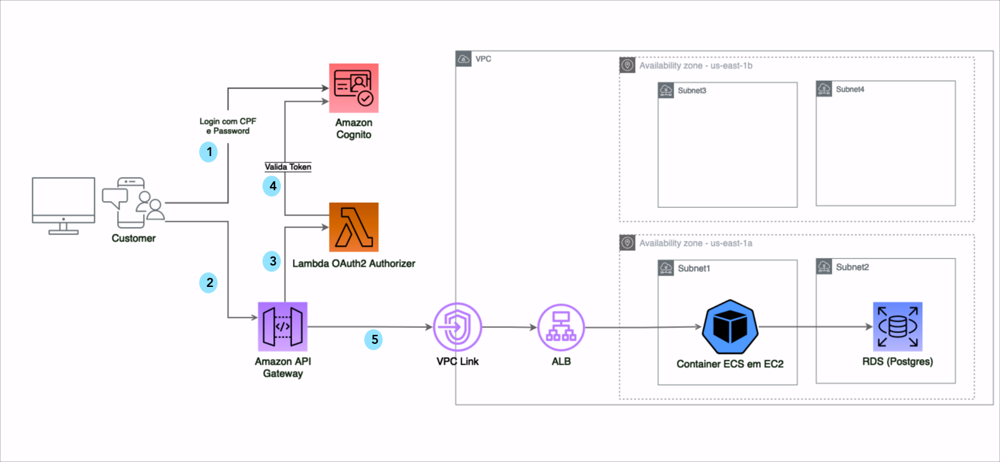

# oAuth2Authorizer
techchallenge_oAuth2Authorizer lambda: Lambda de autorização

Esse repositório contém o código do Lambda techchallenge_oAuth2Authorizer, utilizado para fazer a autorização das chamadas ao backbone do TechChallenge.

Funciona da seguinte maneira:

(1) A autenticação já deve ter sido feita no COgnito de algum modo.  O Cognito retorna um Access Token em resposta a essa autenticação.

(2) Na chamada ao backbone através do API GW, um access token  (obtido previamente através da auteticação no Cognito) é enviado para através do header Authorization.

(3) O API GW chama o lambda techchallenge_oAuth2Authorizer para verificar o token fornecido.

(4) O lambda verifica chama o Cognito par validar o token.

(5) Caso o token seja válido, o API GW chama o endpoint do backbone que está rodando em um container ECS.

#
